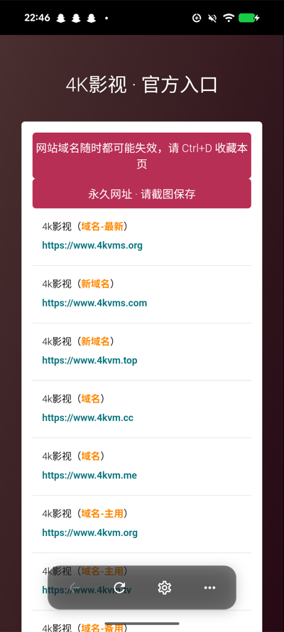
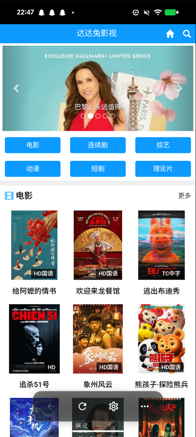
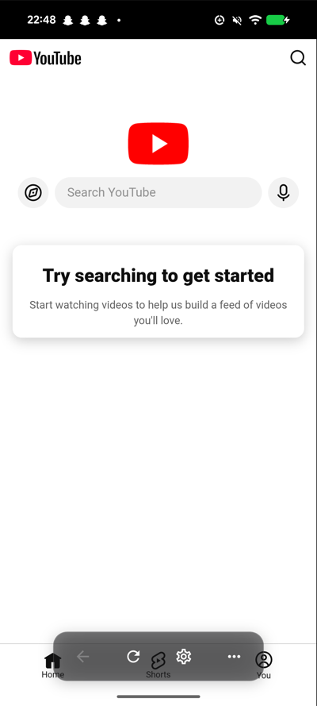
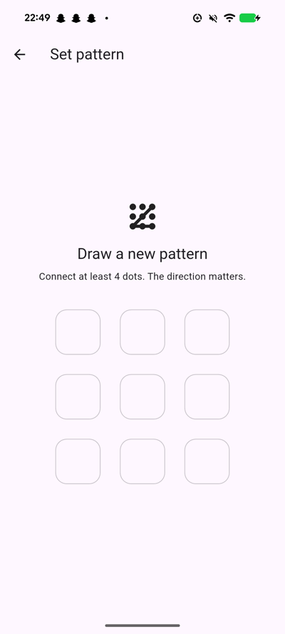
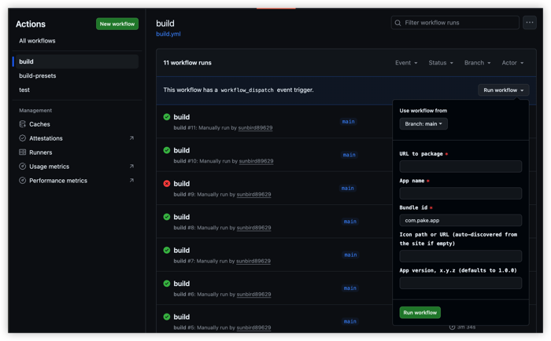

# pake_mobile

把任意网页打包成 Android / iOS 原生 App。

## Why

很多网站只在浏览器里活着，不是它们不配有个 app，是没人给它们打包。

- 📱 **点开就是它**——天天用的站值得一个图标
- 🖥 **没有浏览器打扰**——地址栏、工具栏、多标签都不在了，屏幕全是内容
- 🔒 **应用锁**——手势图案锁住冷启动，手机递给别人也打不开你的追剧 app。
- 🚀 **持续更新**——功能一直在加，下一步做什么看[路线图](#路线图)

按你的需求选一条路：

- **装现成的 app？** → [用现成的 app](#预构建-app)
- **给一个网站打包？** → [打包自己的网站](#打包自己的网站)
- **改代码、发版本？** → [参与开发](docs/development.md)

## 预构建 App

>  预构建 App 是已经打包好的成品——对应的网站已经被装进壳、签好名。你只要现在安装就能用。

| App | 干什么的 | 下载 |
|---|---|---|
| 4KVM | 4K 高清影视，电影美剧日更，打开即看 | [fourkvm-v0.2.0](https://github.com/sunbird89629/pake_mobile/releases/tag/fourkvm-v0.2.0) |
| DADATU（哒哒兔） | 电影、综艺、动漫在线观看 | [dadatu-v0.2.0](https://github.com/sunbird89629/pake_mobile/releases/tag/dadatu-v0.2.0) |
| YouTube | 网页版装成独立的 App，打开即用 | [youtube-v0.2.0](https://github.com/sunbird89629/pake_mobile/releases/tag/youtube-v0.2.0) |

  

### 设置页

底部悬浮工具栏上的 ⚙。工具条浮在网页之上，上滑隐藏、下滑显示，滑到页面
顶部或换页时必然出现（网页播放器进全屏时也让位）。同一条栏上还有后退、
刷新和「更多」（⋯）。

**这条栏没有关闭开关**，这是刻意设计：它和错误页上的按钮是仅剩的两个设置
入口，允许关掉就等于允许用户把自己锁在外面。

系统返回键被接管成网页后退，退无可退时才退出 app——壳里只有一个页面，返回
键的默认行为（直接杀掉 app）在网页场景里几乎总是误操作。

正式包（你下载到的就是）里的设置页是短版：注入脚本开关、App Lock、版本与
检查更新、清缓存。URL、User agent 那类调试项只在 debug 构建里显示。

### 应用锁

设置页里可以开一道手势图案锁（3×3 九宫格，至少连 4 个点）：冷启动时锁，
切后台超过 30 秒回来也锁。图案有方向，`1-2-3` 和 `3-2-1` 不是同一个。

存的是图案的 SHA-256（不加盐）：翻一眼存储文件不会直接看到密码——不防拿到
设备的人枚举，全部合法图案不到 40 万种。**忘了图案没有恢复路径**：锁屏
盖住了工具栏，系统返回键也不响应，只能清应用数据或重装。这是刻意的：
留后门的锁不叫锁。

### 分享

底部栏的 ⋯ → Share app，走系统分享面板。发出去的是**这个 app 本身**：名字、
一句介绍、本版本 release 页地址（`<bundleId 末段>-v<version>` 的 tag）。朋友
从 release 页按自己的设备挑 APK 装——直链只能钉死一个 ABI，发错设备就是
「应用未安装」。介绍文案来自打包时写进配置的 `description`。

### 检查更新

* 冷启动时去主仓的 GitHub Releases 查有没有新版，一天最多一次
* 有新版本就会弹出更新提示框，点「更新」跳系统浏览器下 APK
* 设置页里可以手动检查更新，可以关闭自动检查更新

## 打包自己的网站

给任意网站打个包，全程在 GitHub 上完成，本机不用装 Flutter SDK、Android
SDK、JDK。

1. **[Fork 这个仓库](https://github.com/sunbird89629/pake_mobile/fork)**
   ——`workflow_dispatch` 要仓库的写权限，在别人的仓库里你看不到
   `Run workflow` 那个按钮。
2. 去你 fork 的 **Actions** 页 → 左边选 **build** → 右上 **Run workflow**
3. 填表：URL 和 app 名必填，bundle id 默认 `com.pake.app`（打多个 app 要各不
   相同，否则装在一起会互相覆盖）；图标留空会自己从站点抓，抓不到就按 app 名
   生成一个（见[图标从哪来](#图标从哪来)），版本留空是 `1.0.0`
4. 跑完在仓库的 **Releases** 里取包——不用去 Artifacts，那个 90 天就过期了

一次出三个包（`--split-per-abi`），现役手机基本都装
`app-arm64-v8a-release.apk`。有 Gradle 缓存时约 4~5 分钟（实测）；fork 后
第一次跑是冷缓存，要明显更久。

### 重要：fork 出来的包不能升级

fork 里没有签名密钥，构建会回落到 Flutter 的 debug key，而**那个 key 每次
构建都不一样**。后果不是装不上，是装得上但升不了级：第二次构建出的包想覆盖
第一次那个，会被系统以签名不符拒绝，只能卸载重装、丢掉 app 里的所有数据。
构建结果页（job summary）会标出本次是哪种签名。

自用的话忍一次卸载重装也行。要能持续更新，就在你自己的 fork 里配一次密钥，
设成三个 repo secret——生成方式和 secret 名字见
[Android 发布签名](#android-发布签名)。**这个 keystore 丢了就没法再给同一个
app 发更新**，备份它。

另外：这样打出来的包，app 里的「检查更新」不会有反应，不是坏了——壳里的
更新源写死指向主仓，而你的 release 发在自己的 fork 里，两边对不上。自己
构建的包靠自己重新构建来更新。

### 图标从哪来

`--icon` 给了就用给的。没给就从站点找，按这个顺序：页面 `<link rel=icon>` →
`manifest.json` 的 icons → `/favicon.ico` → Google 的 favicon 服务。逐个下载
到能解码为止——后缀会骗人（`x.com/apple-touch-icon.png` 返回的是 287KB 的
首页 HTML），而且第一个能解码的未必最大，所以拿到 192px 以上才收工。

**一个都抓不到时，按 app 名生成一个**：纯色底 + 一个白色大字符，颜色由名字
哈希决定，同样的名字每次生成的都一样。字符取名字里第一个 ASCII 字母或数字
（`4KVM` → `4`，`4K影视` → `4`）；名字全是中文就退到 bundleId 末段
（`com.pake.dadatu` → `D`）——内置的是 Arial 位图字体，画不了汉字，而
bundleId 永远是 ASCII。

这一步替掉的是模板里那个默认地球仪：抓不到图标的站点不算少（`4kvm.site` 就
声明了一个 404 的 `/ico.png`），装一屏地球仪根本分不出谁是谁。构建结果里的
`icon` 字段会写明是 `generated` 还是某个 URL。

## 参与开发

**[docs/development.md](docs/development.md)** ——结构、测试、发布签名、版本发布、
预设站点、退出码，都在里面。

## 路线图

项目一直在动。接下来想做的、对用户最明显的几件：

- 🎬 **内置视频播放器**——倍速、手势、进度记忆，影视站体验翻倍
- 🚫 **去广告样式**——内置 adblock 注入，一键开关
- 🔍 **页内查找**——长文站点找东西
- 🏠 **回主页按钮** + **外链丢系统浏览器**
- 📦 **打包本地 HTML**——AI 生成的网页直接装成 app，不用部署服务器

最近完成：分享 app 本身（2026-08-29）· 预构建签名收敛到 CI（2026-08-26）。

完整清单（含「不做」和「已完成」）见 [docs/roadmap.md](docs/roadmap.md)。
